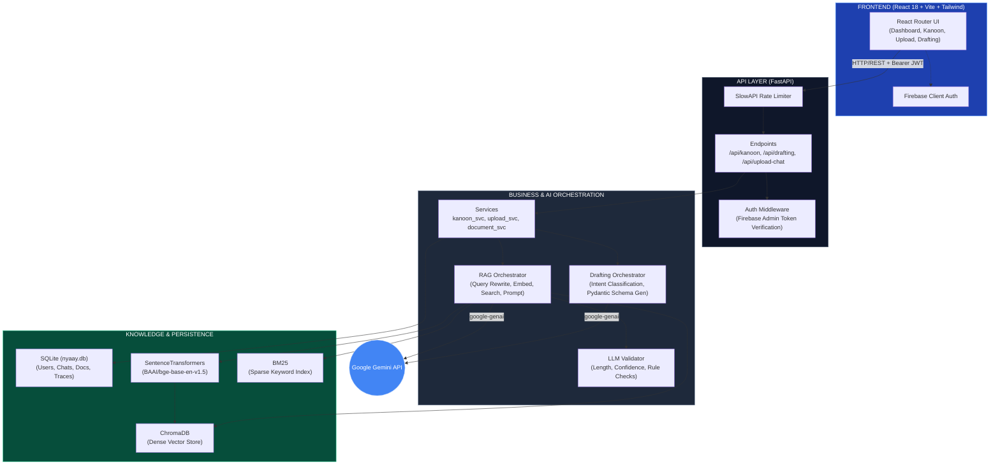
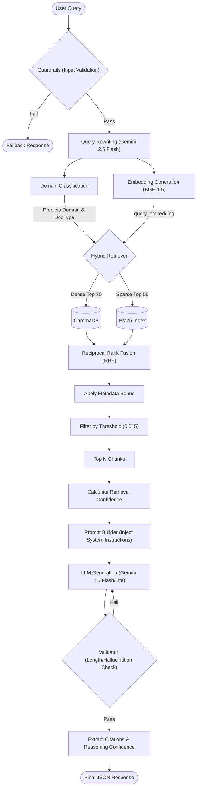

# NYAAY AI — Indian Legal AI Workspace

<div align="center">


**An AI-powered legal workspace engineered for the Indian Judiciary Ecosystem.**
Legal Reasoning · Document Drafting · Document Analysis · Know Your Kanoon

</div>

---

## 1. Executive Overview

NYAAY AI is a full-stack, AI-powered legal assistant built specifically for the Indian legal ecosystem. It serves as an intelligent intermediary between complex legal statutes, judicial precedents, and end-users (ranging from citizens to professional lawyers). 

Rather than functioning as a standard wrapper around an LLM, NYAAY AI incorporates a deterministic, metadata-aware **Hybrid Retrieval-Augmented Generation (RAG)** pipeline designed to significantly minimize LLM hallucinations. It achieves this by forcing the generative models (Google Gemini 2.5 Flash / 2.0 Flash) to ground their answers in rigorously chunked, explicitly retrieved Indian Bare Acts and (progressively) Supreme Court judgments. 

The platform supports four primary workflows:
1. **Know Your Kanoon**: System-wide RAG querying against a curated Indian legal corpus.
2. **Upload & Chat (User RAG)**: Multi-tenant, isolated querying against user-uploaded PDFs and DOCX files.
3. **Legal Drafting**: Deterministic, schema-enforced generation of legal documents (Affidavits, Notices, Complaints) preventing formatting hallucination.
4. **Legal Reasoning**: A specialized pipeline for producing 360-degree legal case studies, generating highly structured JSON outputs mapping facts to statutes, risks, and strategies.

---

## 2. Architecture and Component Interaction

The application follows a decoupled client-server architecture, cleanly separating the AI/Retrieval logic from the Web API and Presentation layers.



### Component Breakdown
- **Frontend Layer (`FRONTEND/src/`)**: A Single Page Application (SPA) driven by React Router. Uses Tailwind CSS for styling. Authenticaton relies on the Firebase Client SDK. The architecture separates page-level views (`FRONTEND/src/pages/`) from modular UI features (`FRONTEND/src/components/chat/`).
- **Middleware & Security (`BACKEND/app/middleware/auth.py`)**: Uses `firebase-admin` to cryptographically verify the JWT tokens sent by the React frontend, yielding a `VerifiedToken` (containing `uid`). 
- **API & Services (`BACKEND/app/routes` & `BACKEND/app/services`)**: The `routes` directory strictly handles HTTP request/response parsing via Pydantic schemas, delegating business logic (like updating the SQLite DB or invoking AI) to `services`.
- **AI Orchestrators (`BACKEND/app/ai/`)**: The "brains" of the operation. Orchestrators abstract away the LLM logic, converting unstructured natural language into specific database queries, generating LLM prompts, and enforcing structural validation on the outputs.
- **Knowledge Layer (`BACKEND/app/knowledge/`)**: Manages `ChromaDB` (persistent local vector store) and `rank_bm25` (in-memory sparse index), wrapping them in a `HybridRetriever`.

---

## 3. Technical Deep Dive: The RAG & AI Pipeline

NYAAY AI's RAG pipeline implements multi-stage processing designed to force exact legal citations and penalize hallucination.



### 3.1. The Standard RAG Flow (`orchestrator.py`)

**What it does:** Processes natural language queries into legally grounded answers with inline citations.
**How it works & Logic Path:**
1. **Guardrails**: `guardrails.validate_input(question)` runs a sanity check on length and basic safety policies.
2. **Query Rewriting**: `_rewrite_query()` takes the last 4 messages of conversation history and asks Gemini to output a *standalone query* optimized for vector search. This resolves anaphora (e.g., converting "What is the punishment for it?" to "What is the punishment for theft under IPC?").
3. **Domain Classification**: `domain_classifier.predict_domain()` predicts the legal domain (e.g., "Criminal Law") and prioritizes a document type (e.g., "statute").
4. **Embedding**: The rewritten query is prefixed with `"Represent this sentence for searching relevant passages: "` and embedded locally using `BAAI/bge-base-en-v1.5` on CPU/CUDA.
5. **Hybrid Search**: `hybrid_retriever.search()` retrieves chunks (detailed in 3.2).
6. **Confidence Scoring**: `validator.calculate_retrieval_confidence()` checks the metadata of retrieved chunks. *Algorithm*: If chunks contain *both* a statute and a judgment, confidence is `High (95)`. If only statutes, `High (80)`. If only judgments, `Moderate (75)`. If neither, `Limited (60)`.
7. **Prompt Construction**: `prompt_builder.construct_prompt()` injects chunks into the prompt alongside specific system instructions based on the mode (Citizen, Professional, Research).
8. **Generation with Exponential Backoff**: Queries the Gemini API. If the model fails or hits a rate limit (429/Resource Exhausted), it sleeps with exponential backoff (5s, 10s, 20s) and rotates through models (`gemini-2.5-flash`, `gemini-2.0-flash`, `gemini-flash-lite-latest`).
9. **Validation**: `validator.validate_response()` ensures the output is >50 chars and heavily penalizes hallucinations (like the model inventing a "percentage likelihood"). If validation fails, it triggers a single automatic retry.
10. **Extraction**: Post-processes the output to detect inline `[X]` citations, correlates them with chunk metadata to map to the UI's "Source Documents Retrieved" section, and builds the final JSON payload.

### 3.2. Hybrid Retrieval with Metadata Bonus (`hybrid_retriever.py`)

**Why it exists**: Dense embeddings often suffer from domain leakage (e.g., retrieving civil tenancy laws when asking about criminal trespass). BM25 handles exact keyword matches well but misses semantic meaning. 
**Algorithm & Tradeoffs**:
1. Fetches Top 30 dense chunks (Chroma) and Top 50 sparse chunks (BM25).
2. Calculates an RRF Score for each unique chunk: `RRF = 1.0 / (60 + Rank)`.
3. **Metadata Bonus**: This is the core mechanism preventing hallucination. For every chunk retrieved, it adds synthetic RRF points based on metadata matches:
   - *Domain Match*: `+ 0.025 * predicted_domain_confidence`
   - *DocType Match*: `+ 0.015`
   - *Act Name Match*: `+ 0.02` (if at least 2 words of the query overlap with the chunk's `act_name`).
4. **Limitation**: Hard-coding bonus weights (0.025, 0.015) is heuristic and may require tuning if the corpus expands significantly.

### 3.3. Deterministic Drafting Pipeline (`drafting_orchestrator.py`)

**What it does:** Generates ready-to-file legal documents (e.g., Affidavits, Notices).
**How it works**:
Instead of asking the LLM to output markdown directly (which leads to inconsistent formatting), the drafting pipeline enforces a strict Pydantic JSON schema (`StructuredDocumentObject`).
1. **Intent Classification**: Evaluates user facts to determine the document type (e.g., `AFFIDAVIT`).
2. **Missing Info Wizard**: Checks if the user provided the `mandatory_fields` required by that document's schema template. If not, it halts and asks the user (returning `MISSING_INFO`).
3. **Retrieval**: Grabs 3 context chunks regarding the laws governing the chosen document type.
4. **Structured Generation**: Passes the `StructuredDocumentObject.model_json_schema()` to Gemini, demanding a raw JSON output.
5. **Editing**: Allows users to pass "Edit Instructions" against an existing JSON draft. The LLM applies the change to the `body` array and increments `metadata.version`.

### 3.4. Upload & Chat RAG (`upload_chat_service.py`)

**What it does**: Allows users to chat specifically with documents they uploaded.
**How it connects**: Uses the exact same `RAGOrchestrator`, but heavily modifies the retrieval scope. When querying ChromaDB, it enforces a metadata filter: `{"$and": [{"document_id": request.document_id}, {"tenant_id": user_uid}]}`. 
**Why it exists**: This multi-tenant approach allows the system to utilize a single global ChromaDB collection (`nyaay_knowledge`) while cryptographically isolating user documents based on their Firebase `user_uid`.

---

## 4. The Database Schema

Persistence is handled by a local SQLite database (`nyaay.db`) via SQLAlchemy.

1. **`User` (`user.py`)**: Synchronized from Firebase Auth. `firebase_uid` serves as the primary key. Stores `email`, `name`, and `role` (citizen/student/lawyer). *Note: No passwords are stored locally.*
2. **`Conversation` (`chat.py`)**: Maps to a specific `user_id` and `FeatureType` (e.g., `know_kanoon`, `upload_chat`, `legal_reasoning`). Tracks whether a chat is pinned.
3. **`Message` (`chat.py`)**: Stores chronological messages within a Conversation. `role` is either `user` or `assistant`. The `content` column stores raw text for users, but heavily structured JSON strings for the assistant, which the frontend parses for rendering.
4. **`Document` (`document.py`)**: Tracks user uploads. Links `firebase_uid` to the physical `filepath` in the `uploads/` directory, storing `pages`, `extracted_text`, and an LLM-generated `summary`.
5. **`RetrievalTrace` & `AnalysisSnapshot` (`reasoning.py`)**: Specialized tables for the Reasoning module. *Why they exist:* `RetrievalTrace` stores the retrieved chunk arrays separately from the generated output. This allows the system to regenerate complex legal opinions (`AnalysisSnapshot`) when a user alters their facts, without incurring the time and compute penalty of re-running vector retrieval.

---

## 5. Data Ingestion & Corpus Engineering

The system depends on a highly curated corpus of Indian Bare Acts (currently 93 Markdown files in `BACKEND/corpus/`).

### Pipeline Manager (`BACKEND/scripts/pipeline_manager.py`)
**What it does**: Offline ingestion script that populates ChromaDB and the BM25 index.
**How it works**:
1. Iterates over `BACKEND/corpus/*.md`.
2. Computes a SHA-256 hash of the file. Skips ingestion if the hash already exists in ChromaDB (Duplicate Prevention).
3. Parses YAML-like frontmatter for critical metadata (`source_name`, `legal_domain`, `document_type`, `act_name`).
4. Passes text to the Semantic Chunker.
5. Generates embeddings using `BAAI/bge-base-en-v1.5`.
6. Upserts to `ChromaDB` and triggers `bm25_manager.rebuild_index("global")`.

### Semantic Chunking (`BACKEND/app/knowledge/chunking.py`)
**Algorithm**: Standard character-count chunking ruins legal texts by splitting sentences in half. `LegalStructuralChunker` uses Regex patterns (`Part`, `Chapter`, `Section`, `Article`) to identify hierarchical boundaries. 
- **Important Parameters**: `max_chunk_size` = 1500, `overlap` = 200.
- **Context Enrichment**: Before returning a chunk, it prepends the structural hierarchy to the text itself (e.g., `[Bharatiya Nyaya Sanhita > Chapter XII > Section 173]`). *Why it exists:* This drastically improves dense retrieval accuracy because the embedded vector now contains explicit hierarchical context, preventing the LLM from losing track of which Act a generic paragraph belongs to.

---

## 6. Local Setup & Deployment

### Prerequisites
- Python 3.11+
- Node.js 18+
- [Google AI Studio](https://aistudio.google.com/) API key (Gemini)
- Firebase Project (Authentication enabled, service account key JSON required)

### Backend Setup
```bash
cd BACKEND
python -m venv venv
# Windows: venv\Scripts\activate | macOS/Linux: source venv/bin/activate
pip install -r requirements.txt
cp .env.example .env 
# Configure GEMINI_API_KEY and FIREBASE_SERVICE_ACCOUNT_PATH in .env
uvicorn app.main:app --reload
```

### Frontend Setup
```bash
cd FRONTEND
npm install
cp .env.example .env
# Configure VITE_FIREBASE_* variables
npm run dev
```
The frontend dev server mounts at `http://localhost:5173`.

---

## 7. File & Directory Map

```text
NYAAY-AI/
├── BACKEND/
│   ├── app/
│   │   ├── ai/                     ← Orchestrators (rag, drafting), Prompt Builder, Validator
│   │   ├── api/v1/                 ← (Empty) Reserved for versioned shared routes
│   │   ├── core/                   ← Config loading, Firebase init, Logger, Metrics
│   │   ├── database/               ← SQLAlchemy engine and session dependency
│   │   ├── ingestion/              ← Raw document parsing & Markdown generation
│   │   ├── knowledge/              ← Retrieval engine (ChromaDB, BM25, Semantic Chunking)
│   │   ├── middleware/             ← Firebase JWT verification (`auth.py`)
│   │   ├── models/                 ← SQLite DB Schemas (chat, document, reasoning, user)
│   │   ├── routes/                 ← FastAPI Controllers (kanoon, upload_chat, drafting)
│   │   ├── schemas/                ← Pydantic validation schemas (e.g., StructuredDocumentObject)
│   │   ├── services/               ← Core business logic bridging routes and AI
│   │   ├── templates/              ← JSON schemas & markdown instructions for document drafting
│   │   └── main.py                 ← FastAPI application entry point
│   ├── corpus/                     ← Master directory of 93 ingested Indian Bare Acts (.md)
│   ├── data/                       ← Staging directory (contains 4,369 raw SC Judgments in JSON)
│   ├── devtools/                   ← Internal developer smoke tests
│   ├── eval/                       ← Benchmarking and evaluation ground truth
│   ├── scripts/                    ← Offline ingestion (`pipeline_manager.py`), benchmarking tools
│   ├── tests/                      ← Pytest suite (Acceptance, Unit, E2E)
│   ├── uploads/                    ← Local storage for user-uploaded PDFs/DOCX
│   └── requirements.txt            ← Python dependencies
├── FRONTEND/
│   ├── src/
│   │   ├── components/             ← Segmented UI components (chat, drafting, kanoon, common)
│   │   ├── contexts/               ← React Contexts (AuthContext)
│   │   ├── hooks/                  ← Custom React hooks
│   │   ├── layouts/                ← Layout wrappers (WorkspaceContainer, ConversationLayout)
│   │   ├── pages/                  ← Route components (Dashboard, KnowYourKanoon, DocHub, etc.)
│   │   └── services/               ← Axios wrappers for API communication
│   ├── package.json
│   └── tailwind.config.js
└── README.md                       ← You are here.
```

---

## 8. Evaluation & Benchmarking

The system employs heuristic automated evaluation to test the retrieval pipeline and LLM adherence.

- **Acceptance Suite (`BACKEND/tests/acceptance_suite.py`)**: Tests the state-machine logic of the Drafting Pipeline. Asserts that incomplete prompts return a `MISSING_INFO` flag, that providing partial info filters the missing fields correctly, that negative prompts (gibberish) are handled safely, and that editing JSON documents correctly increments the version number.
- **Benchmark Run (`BACKEND/scripts/run_benchmark.py`)**: Uses a static set of queries defined in `benchmark_suite.json`. It triggers the actual `kanoon_service.query` and checks if the LLM output explicitly cites the required expected statute string (e.g., "Bharatiya Nagarik Suraksha Sanhita"). Current reports (`benchmark_report.json`) show 100% accuracy on basic statutory retrieval queries.

---

## 9. Known Limitations and Technical Debt

1. **Unindexed Case Law (Supreme Court Judgments)**: While 93 Statutory Acts are fully indexed and operational, the `BACKEND/data/judgments/` folder contains 4,369 raw JSON Supreme Court judgments. These represent Phase 2 of the corpus expansion and are not currently active in ChromaDB.
2. **Synchronous Upload Processing**: In `BACKEND/app/services/document_service.py`, user PDF uploads trigger the RAG ingestion pipeline synchronously during the HTTP request. For massive PDFs, this is likely to result in HTTP timeouts. *Tradeoff*: Kept synchronous for architectural simplicity in early iterations; needs migration to `BackgroundTasks` or Celery.
3. **NLTK Runtime Dependencies**: The `hybrid_retriever.py` calls `nltk.download('punkt')` upon instantiation if missing. In a fresh, containerized deployment without persistent disk caching, this introduces a severe cold-start latency spike on the first retrieval query.
4. **LLM Summary Generation Timeout Limits**: When generating summaries for large uploaded documents, `document_service.py` applies a strict 15-second timeout via `concurrent.futures`. If the LLM rate-limits or stalls, a hardcoded fallback message is saved to the database instead of the summary.
5. **Locked Features**: The `CounterArguments.jsx` page is actively routed in the frontend but displays a "Locked for Sprint 3" state. The backend infrastructure for rebuttal mapping is non-existent.
6. **Local In-Memory Rate Limiting**: The system utilizes `SlowAPI` (in-memory) for rate limiting. This functions perfectly for single-node deployments but will fail to track IPs correctly if scaled horizontally across multiple workers or pods without a centralized Redis cache.
