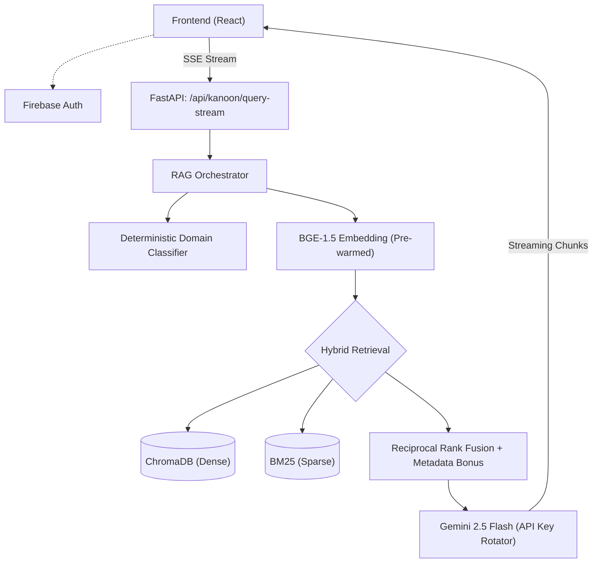

# NYAAY AI — Civic & Legal Empowerment Platform

<div align="center">


**Translating bureaucratic complexity into a clear, guided path for everyday citizens.**
Civic Navigator · Action Plans · Evidence Checklists · One-Click Drafting

</div>

---

## 1. The Vision: From Information to Action

NYAAY AI was rebuilt from the ground up for the **Civic & Legal Empowerment** hackathon track. We realized that giving citizens a generic "legal chat" isn't enough. When a citizen has a broken phone, a withheld security deposit, or a delayed property mutation, they don't need a law lecture—they need a **guided path to resolution**.

NYAAY AI acts as an intelligent intermediary between complex legal statutes and everyday problems. It forces generative models (Google Gemini 2.5 Flash) to ground their answers in rigorously chunked, explicitly retrieved Indian Bare Acts, preventing hallucinations of dynamic procedural facts (like random portal URLs or fake Public Information Officer contacts).

---

## 2. Core Features (The Civic Pivot)

### 🧭 Civic Navigator (Real-Time Streaming)
We rebuilt the core engine for speed and action. The Civic Navigator uses **Server-Sent Events (SSE)** to stream actionable Markdown directly to the user with a **Time-to-First-Token (TTFT) of under 500ms**. 

Every response guarantees the following structure:
1. **Problem & Rights**: What exact law was violated?
2. **Evidence Required**: Checklists of documents (receipts, tracking IDs) to gather.
3. **Relevant Authority**: The exact official to approach (e.g., PIO, District Consumer Forum).
4. **Action Plan**: Step-by-step chronological instructions.
5. **Document Generation**: Direct recommendation to our Drafting tool.

### ⚡ Ultra-Low Latency Architecture
To hit our strict sub-2-second TTFT target, we ruthlessly optimized the RAG pipeline:
- **Zero-LLM Intent Classification**: Replaced slow LLM routers with instantaneous, deterministic regex keyword dictionaries for `RTI`, `Consumer`, and `Tenant` flows (0.0ms latency).
- **Pre-warmed Embeddings**: `SentenceTransformer` models (`BAAI/bge-base-en-v1.5`) are loaded into GPU/CPU memory during the FastAPI lifespan hook, eliminating the 40s cold-start penalty.
- **Context Distillation**: Reduced dense retrieval chunk sizes from 30 to 12, heavily accelerating the LLM's context processing speed.

### 📝 Single-Pass Legal Drafting
The drafting engine no longer wastes time on sequential LLM calls. It injects the metadata, schemas, and instructions for all available templates into a single prompt. In **one generative pass**, the AI:
1. Identifies the correct document type (e.g., Affidavit, Legal Notice).
2. Detects any missing mandatory fields based on the user's facts.
3. Generates the structured JSON document body, intelligently placing placeholders for missing data.

### 🔄 Round-Robin API multiplexing
To survive aggressive hackathon rate limits (Gemini Free Tier), the backend implements thread-safe `key_rotator.py` logic. If a request hits a `429 RESOURCE_EXHAUSTED`, it instantly pivots to the next available key in the `.env` pool, maintaining pipeline stability.

---

## 3. Targeted Demo Flows

The platform is explicitly optimized for three high-impact citizen journeys:

1. **Right to Information (RTI)**
   *Query:* "I've been waiting 6 months for my property mutation. I want to find out what's happening."
   *Action:* Maps to Transparency laws, identifies the PIO, and sets up an RTI application draft.

2. **Consumer Protection**
   *Query:* "I bought an air conditioner from Amazon. It stopped working after 2 months. They're not replacing it."
   *Action:* Maps to the Consumer Protection Act, triggers the warranty dispute flow, and recommends a Legal Notice to the seller.

3. **Tenant Rights (Jurisdiction Aware)**
   *Query:* "My landlord changed the lock without notice because I was 10 days late on rent."
   *Action:* Evaluates illegal eviction under specific state rent control acts and outlines the police complaint/injunction process.

---

## 4. Architecture



---

## 5. Local Setup & Deployment

### Prerequisites
- Python 3.11+
- Node.js 18+
- [Google AI Studio](https://aistudio.google.com/) API keys (Multiple recommended for `.env`)
- Firebase Project (Authentication enabled, service account key JSON required)

### Backend Setup
```bash
cd BACKEND
python -m venv venv
# Windows: venv\Scripts\activate | macOS/Linux: source venv/bin/activate
pip install -r requirements.txt
cp .env.example .env 
# Configure GEMINI_API_KEYS (comma separated) and FIREBASE_SERVICE_ACCOUNT_PATH in .env
uvicorn app.main:app --reload
```

### Frontend Setup
```bash
cd FRONTEND
npm install
cp .env.example .env
# Configure VITE_FIREBASE_* variables
npm run dev
```
The frontend dev server mounts at `http://localhost:5173`.

---

## 6. Known Limitations (Hackathon Scope)
- **API Quota Exhaustion**: The Free Tier limits are extremely tight (20 requests/day/key). During heavy testing, if the backend stalls, it is likely exhausting the daily quota across all keys in the rotator.
- **Hidden Title Generation**: Currently, a background LLM call runs on new chats to generate a title. This consumes a small portion of the daily quota and should be disabled if quota is critical.
- **RAG Pre-computation**: The current database relies on 93 core Indian statutes. Supreme Court judgments are present in raw data folders but are not fully ingested into ChromaDB for the MVP to prioritize core statutory accuracy.
